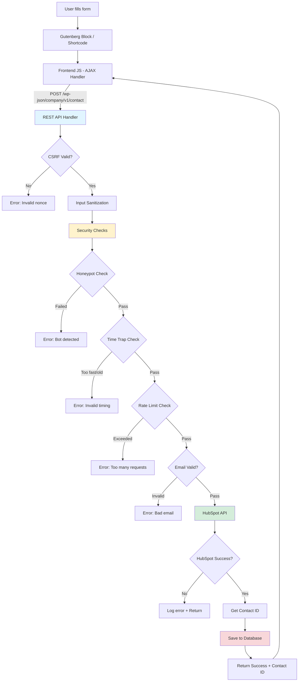
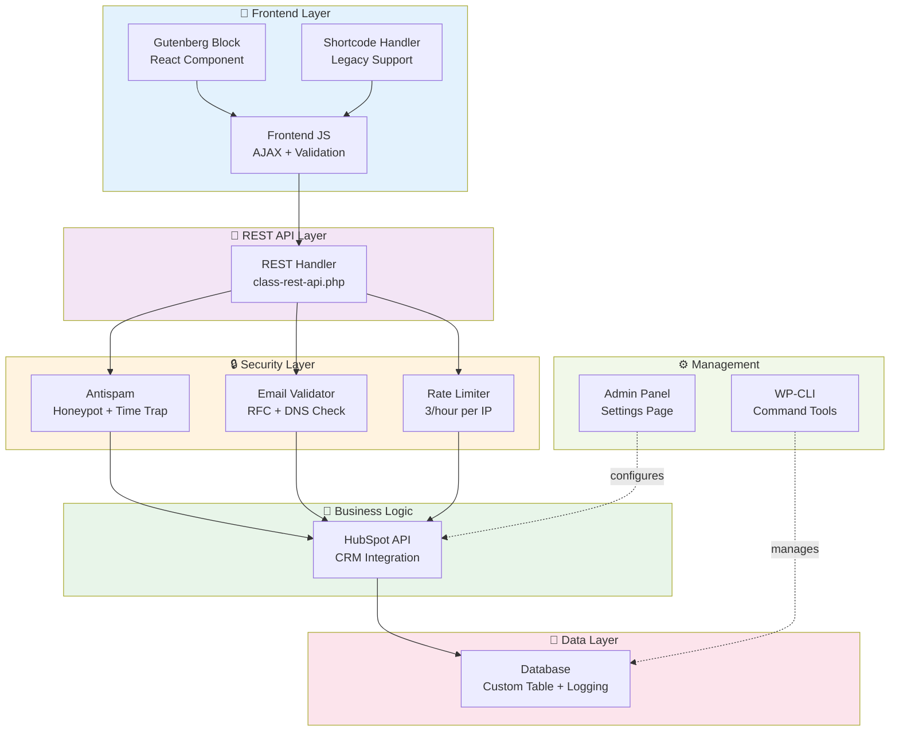

# Contact Form HubSpot WordPress Plugin

A WordPress contact form plugin that integrates with HubSpot CRM. Built with security in mind and designed for both developers and end users.

## Features

- **Gutenberg Block** - Drag-and-drop form builder
- **HubSpot Integration** - Auto-sync contacts to your CRM
- **Security** - Honeypot, rate limiting, time traps, CSRF protection
- **Email Validation** - RFC-compliant with DNS checks
- **Logging** - Track submissions with auto-cleanup after 30 days
- **WP-CLI** - Command-line tools for power users
- **Testing** - PHPUnit test suite included
- **Docker** - Ready-to-go development environment

## Installation

### Quick Start

1. Clone this repo to your WordPress plugins folder:
```bash
cd wp-content/plugins/
git clone https://github.com/muradyangarik/contact-form-hubspot.git
```

2. Activate the plugin in WordPress admin

3. Go to **Settings → Contact Form HubSpot** and add your HubSpot API token

4. Add the block to any page and you're done!

### Docker Development Setup

For local development with a complete environment:

```bash
docker-compose up -d
```

Then access:
- WordPress: http://localhost:8080
- phpMyAdmin: http://localhost:8081  
- MailHog (email testing): http://localhost:8025

### Building Assets

```bash
npm install
npm run build
```

## Architecture

The plugin follows a modular, single-responsibility design. Each component handles one specific task.



### System Components



### File Structure

```
contact-form-hubspot/
├── contact-form-hubspot.php    # Main plugin file (singleton pattern)
├── includes/
│   ├── class-rest-api.php      # Handles /wp-json/company/v1/contact
│   ├── class-antispam.php      # Honeypot + time trap validation
│   ├── class-email-validator.php # RFC 5322 + DNS MX check
│   ├── class-hubspot-api.php   # HubSpot CRM integration
│   ├── class-database.php      # Custom table + log rotation
│   ├── class-admin.php         # Settings page UI
│   ├── class-wp-cli.php        # CLI commands
│   └── class-gutenberg-block.php # Block registration
├── blocks/contact-form/
│   └── block.json              # Block metadata
├── assets/
│   ├── js/
│   │   ├── frontend.js         # Form submission handler
│   │   ├── block-editor.js     # Gutenberg editor UI
│   │   └── admin.js            # Admin page scripts
│   └── css/                    # Styling
└── tests/                      # PHPUnit tests
```

### Data Flow

**Submission Process:**
1. User submits form → Frontend validates required fields
2. AJAX POST with WordPress nonce for CSRF protection
3. REST API sanitizes input + runs security checks in parallel
4. If valid → Create contact in HubSpot CRM
5. Log submission to custom database table
6. Return success message with HubSpot contact ID

**Security Layers:**
- **CSRF**: WordPress nonce verification
- **Bot Protection**: Honeypot field (hidden from humans)
- **Time Trap**: Form must be submitted between 3 seconds and 1 hour
- **Rate Limiting**: Max 3 submissions per hour per IP (using transients)
- **Email Validation**: RFC 5322 syntax + DNS MX record check
- **SQL Injection**: All queries use prepared statements

## Configuration

### HubSpot Setup

1. Go to HubSpot Developer Settings
2. Create a Private App
3. Generate an API token with CRM permissions
4. Enter the token in WordPress Settings > Contact Form HubSpot

### Form Configuration

1. Add the Contact Form block to any page or post
2. Customize the form title, description, and button text
3. Configure success and error messages
4. The form includes all necessary security measures automatically

## Usage

### Gutenberg Block

1. In the WordPress editor, click the "+" button
2. Search for "Contact Form HubSpot"
3. Add the block to your page
4. Customize the form settings in the block sidebar
5. Publish your page

### WP-CLI Commands

```bash
# Test HubSpot connection
wp contact-form test-hubspot

# Show submission statistics
wp contact-form stats

# View submission logs
wp contact-form logs

# Clear rate limits
wp contact-form clear-rate-limits

# Rotate logs (delete old entries)
wp contact-form rotate-logs
```


### Security Measures

1. **Honeypot Field**: Hidden field that bots fill but humans don't
2. **Time Trap**: Prevents submissions faster than 3 seconds or older than 1 hour
3. **Rate Limiting**: Maximum 3 submissions per hour per IP address
4. **CSRF Protection**: WordPress nonce verification
5. **Input Sanitization**: All inputs sanitized and validated
6. **SQL Injection Prevention**: Prepared statements for all database queries

## Development

### Prerequisites

- PHP 7.4 or higher
- WordPress 5.0 or higher
- Node.js 16 or higher (for asset building)
- Composer (for dependencies)

### Setup Development Environment

1. Clone the repository
2. Run `composer install`
3. Run `npm install`
4. Set up WordPress test environment
5. Run `npm run build` to build assets

### Running Tests

```bash
# Install WordPress test environment
bash bin/install-wp-tests.sh wordpress_test root root localhost latest

# Run PHPUnit tests
./vendor/bin/phpunit

# Run PHP_CodeSniffer
./vendor/bin/phpcs --standard=phpcs.xml
```

### Code Standards

This plugin follows WordPress Coding Standards:

- WordPress-Core
- WordPress-Extra
- WordPress-Docs

Run `./vendor/bin/phpcs` to check code standards compliance.

## API Reference

### REST API Endpoint

**POST** `/wp-json/company/v1/contact`

#### Parameters

| Parameter | Type | Required | Description |
|-----------|------|----------|-------------|
| first_name | string | Yes | User's first name |
| last_name | string | Yes | User's last name |
| email | string | Yes | User's email address |
| subject | string | Yes | Message subject |
| message | string | Yes | Message content |
| website | string | No | Honeypot field (should be empty) |
| form_timestamp | integer | Yes | Form load timestamp |
| _wpnonce | string | Yes | WordPress nonce |

#### Response

```json
{
  "success": true,
  "message": "Thank you for your message. We will get back to you soon!",
  "contact_id": "12345"
}
```


## Limitations

- **Single HubSpot Account**: Only one HubSpot API token per site (multi-tenant not supported)
- **No File Uploads**: Form only handles text inputs (name, email, message)
- **Simple Contact Creation**: Creates contacts only, doesn't handle deals or tickets
- **Rate Limit Per Site**: 3 submissions/hour per IP applies globally, not per form
- **No CAPTCHA**: Uses honeypot + time trap instead (no Google reCAPTCHA integration)
- **English Admin UI**: Backend interface not fully translated yet

## Trade-offs

### Custom Database Table vs Post Meta
**Choice**: Custom `wp_contact_form_submissions` table  
**Why**: Better performance for queries and easier log rotation. Post meta would clutter wp_postmeta table.  
**Cost**: Custom table requires maintenance on activation/deactivation.

### WordPress Transients vs Redis
**Choice**: WordPress transients for rate limiting  
**Why**: Works out of the box, no additional dependencies.  
**Cost**: Not persistent across cache flushes. For high-traffic sites, Redis would be better.

### Synchronous HubSpot API vs Queue
**Choice**: Direct API call during form submission  
**Why**: Simpler architecture, immediate feedback to user.  
**Cost**: Form submission waits for HubSpot response (adds ~500ms). Async queue would be faster but more complex.

### REST API vs Admin-Ajax
**Choice**: WordPress REST API  
**Why**: Modern, standardized, better for future integrations.  
**Cost**: Requires WordPress 4.7+. Admin-ajax would support older versions.

### Honeypot vs CAPTCHA
**Choice**: Honeypot field + time trap  
**Why**: Better UX (no clicking images), privacy-friendly (no Google tracking).  
**Cost**: Less effective against sophisticated bots. Works great for 95% of spam.

## License

This plugin is licensed under the GPL v2 or later.

## Support

For support, please open an issue on GitHub or contact the plugin author.

## Changelog

### 1.0.0
- Initial release
- Gutenberg block implementation
- REST API endpoint
- HubSpot integration
- Security measures
- Admin interface
- WP-CLI commands
- Unit tests
- CI/CD pipeline
- Docker support
- Internationalization


